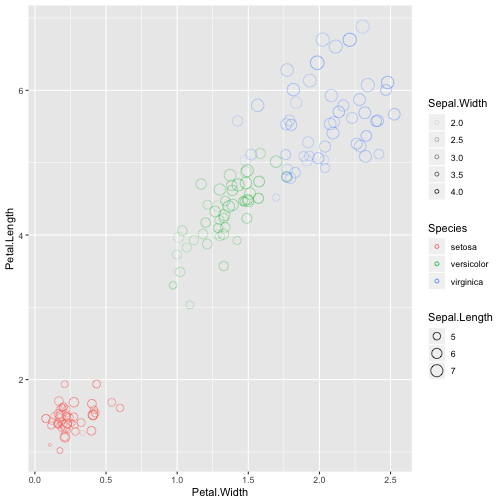

## The iris data set

- Published by Edgar Anderson, 1935.
- Consists of a three-level factor (Species) and 4 continuous numerical measures (length and width of the flower petals and sepals)
- Is perhaps the most common dataset used for turorials, examples and vigenettes among R coders, making it a bit cliche

```r
head(iris)
```

```
##   Sepal.Length Sepal.Width Petal.Length Petal.Width Species
## 1          5.1         3.5          1.4         0.2  setosa
## 2          4.9         3.0          1.4         0.2  setosa
## 3          4.7         3.2          1.3         0.2  setosa
## 4          4.6         3.1          1.5         0.2  setosa
## 5          5.0         3.6          1.4         0.2  setosa
## 6          5.4         3.9          1.7         0.4  setosa
```

---
## Why so popular

- It's familiar
- Manageable size, with 150 observations 
- Just complex enough to test a wide range of analytical approaches
- Consider the following plot by way of example ...

---

```r
library(ggplot2)
ggplot(iris, aes(x = Petal.Width, y = Petal.Length, size = Sepal.Length, col = Species, alpha = Sepal.Width)) +
    geom_jitter(shape = 1)
```



---
## So I used it in my Shiny app

My Shiny app (for this final project) explores how cross validation affects different models when training them.

You can check it out: [**click here!**](https://sinjin.shinyapps.io/ddp_shiny_app/)

I hope you agree that the iris dataset is a useful tool. 

If nothing else, I hope you didn't mind me using this "cliche" dataset for my final class project!
